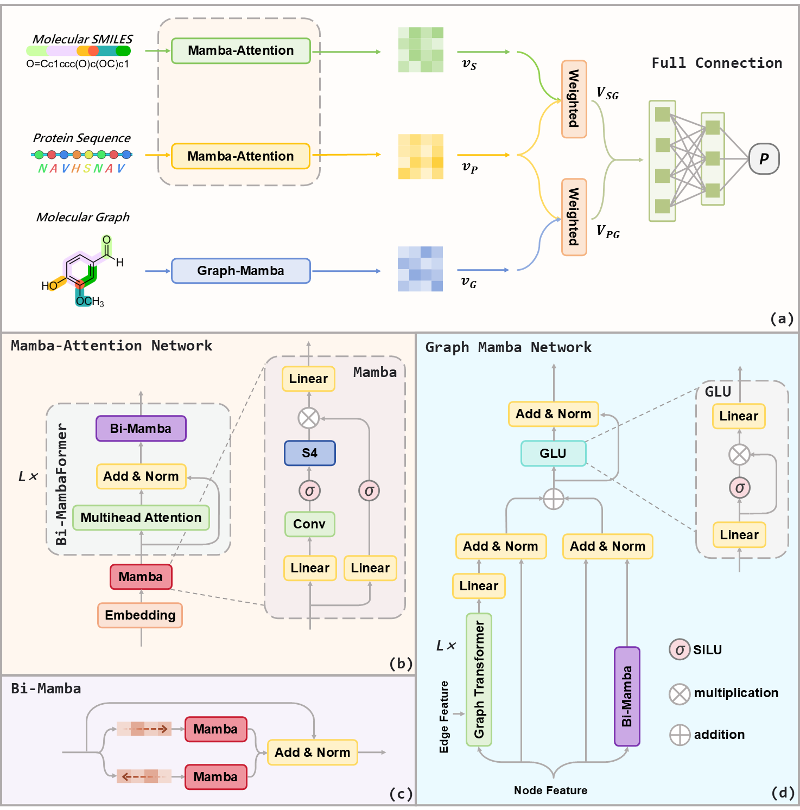

# BiMA-DTI: A Bidirectional Mamba-Attention Hybrid Framework for Enhanced Drug-Target Interaction Prediction

BiMA-DTI is a novel deep learning framework that integrates bidirectional Mamba and attention mechanisms to improve the accuracy of drug-target interaction (DTI) prediction. This model leverages both sequence and 2D graph information to better capture complex interactions between drugs and targets.

<p align="center">
  
</p>
<p align="center"><b>Overview of the BiMA-DTI framework</b></p>

## Navigation
| Fold     | In Short                          | Description                 |
|----------|-----------------------------------|--------------------------|
|data|Our dataset.|Each dataset contains the experimental Settings E1 (random), E2 (drug cold-start), E3 (protein cold-start), and E4(double cold-start). Among them, each experimental setting of Human, C.elegans, BioSNAP and BindingDB contains 10 random partitions, while the TTD only contains the FDA-approved documents after screening.The TTD dataset we processed is publicly available on [Google Drive](https://drive.google.com/drive/folders/1lGhKKy31SSTHLgaBj0gYw9mSwgDrUwdl?usp=sharing), due to the large amount of data, we did not conduct ten random divisions.|
|fig|Figures in our paper.|Fig1 shows the framework of BiMA-DTI. Fig2-3 are the comparisons of AUROC and AUPRC between BiMA-DTI and the baseline model on BindingDB, BioSNAP and TTD. Fig4-5 are the ablation experimental results of BiMA-DTI. Fig6-7, as well as FigS1-S2, are the visualization studies results.|
|mambapy|Mamba package.|Downloaded from https://github.com/alxndrTL/mamba.py/tree/main/mambapy|


## System Requirements
```bash
torch==1.12.1
torch-geometric==2.3.1
rdkit==2023.9.3
transformers==4.35.2
pandas==1.5.3
numpy==1.23.5
scikit-learn==1.3.0
```

## Usage
- `main.py`: Entry point for training and testing the BiMA-DTI model.You can modify the dataset and experimental Settings respectively in the line 100 and the line 96.

To run with default settings:
```bash
python main.py
```

## Data availability
All data used in this work are from public resource. The BindingDB and BioSNAP source is at https://github.com/peizhenbai/DrugBAN and the Human and C.elegans source is at https://github.com/masashitsubaki/CPI_prediction. TTD source is at https://db.idrblab.net/ttd/.

## Contact Us
**1. Github issue** (recommended)   
you can open an issue on GitHub.

**2. E-mail**      
If you wish to have in-depth contact with the BiMA-DTI development team, please send an email to shuiyouyuan@stu.njmu.edu.cn .

## Citation
Please cite our paper if you find our work useful in your own research.
